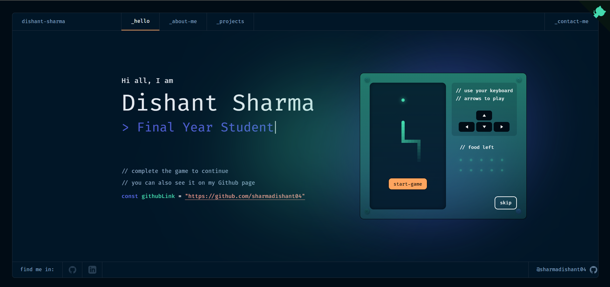

# Dishant Sharma - Portfolio

<p align="center">
  A modern, responsive portfolio website showcasing my work as a Python Developer with expertise in Backend Development, AI/ML, and Blockchain. Built with <a href="https://nuxt.com/" target="_blank">Nuxt.js 3.0</a>.
</p>

<p align="center">
  <a href="https://github.com/sharmadishant04/portfoliov1.git" target="_blank">
    
  </a>
</p>

## About

This portfolio website showcases my professional experience, projects, and skills in:
- Python Development
- Backend Development
- AI/ML
- Blockchain Technology
- Full Stack Development

## Features

- Modern and responsive design
- Interactive project showcase
- Detailed about section
- Contact form
- Dark theme
- PWA support

## Projects Highlighted

1. **Decentralized Real Estate Platform**
   - Blockchain-based platform for secure property transactions
   - Tech: Blockchain, React, Node.js, Express, Web3

2. **Voice-Controlled Website**
   - Enhanced web accessibility through voice commands
   - Tech: JavaScript, Web Speech API, HTML, CSS

3. **Stock Prediction with LSTM**
   - AI-powered stock price forecasting
   - Tech: Python, LSTM, Machine Learning, Data Analysis

## Installation

1. Clone the repository:
```sh
git clone https://github.com/sharmadishant04/portfoliov1.git
```

2. Navigate to the project directory:
```sh
cd portfoliov1
```

3. Install dependencies:
```sh
yarn
```

4. Start the development server:
```sh
yarn dev
```

The development server will run on [http://localhost:3000/](http://localhost:3000/)

## Building for Production

1. Generate a production build:
```sh
yarn build
```

2. Preview the production build:
```sh
yarn preview
```

## Contact

- Email: sharmadishanto4@gmail.com
- GitHub: [@sharmadishant04](https://github.com/sharmadishant04)
- LinkedIn: [Dishant Sharma](https://www.linkedin.com/in/dishant-sharma-12a1bb246/)

## Credits

This portfolio is based on the template designed by [@darelova](https://www.behance.net/darelova) and developed by [@alexdeploy](https://github.com/alexdeploy). Modified and personalized by Dishant Sharma.

## License

This project is licensed under the MIT License. See the [LICENSE](LICENSE) file for details.